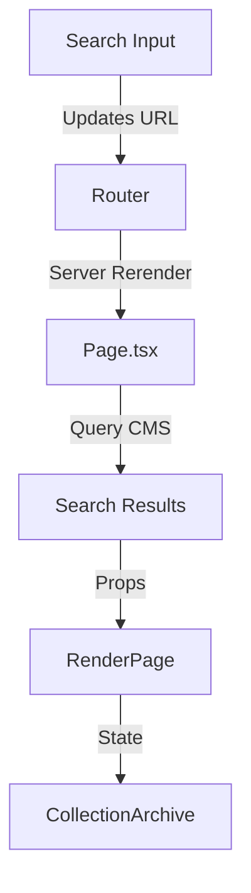

# Search System Blueprint

## Flow Overview

URL-Driven Search:

- Search state is managed through URL parameters (/?q=searchterm)
- Server handles initial search via URL params
- Client-side updates URL as user types

## Data Flow:



## Key Components

### 1. Server-Side Search ([page.tsx](./page.tsx))

```ts
// Handles search query from URL params
const queryTattoos = query ? await payload.find({
  collection: 'search',
  where: {
    or: [
      { title: { contains: query } },
      { 'styles.title': { contains: query } }
    ]
  }
  // ... other options
})
```

### 2. Search Input ([Search.tsx](./Search.tsx))

Key features:

- Debounced input handling
- URL-based state management
- Router navigation for search updates
- Loading state management

### 3. Results Display ([RenderPage.tsx](./RenderPage.tsx))

Manages:

- Search results state
- Conditional rendering of results/default view
- Visibility transitions

### 4. Results Grid ([CollectionArchive.tsx](./components/CollectionArchive.tsx))

Handles:

- Grid layout of results
- Card rendering
- Empty state handling

## Search States

Empty/Initial:

- Shows default grid view with featured tattoos
- Search results hidden

Active Search:

- Default grid hidden
- Search results visible
- Shows "No results" message if empty

## Implementation Notes

- Uses server-side search for initial load
- Client-side URL updates for subsequent searches
- Debounced search to prevent excessive API calls
- Smooth transitions between states
- Future integration point for [CategoryListSlider](./category-list-slider/index.tsx)

  This setup provides a foundation for a server-side rendered search with client-side updates, maintaining good UX through loading states and transitions.
